# Ollama-scan-ui

Vibe Coding，介意勿用。详情见Prompt.md

功能部分摘取https://github.com/b3nguang/Ollama-Scan

源代码自己看，不介绍了。

清纯小巧女生自用款（不是）


## 运行

运行就是

```
pip install -r requirements.txt
```

```
python gui.py
```


想要自己打包为exe就安装一个包，然后

```
pyinstaller --onefile --windowed gui.py
```

发现这个打包太大了，14MB，应该换种打包或者upx压缩一下


默认运行会直接有一个yaml文件和一个result文件夹坨屎而出。

导出结果默认就是result了。


## 项目文件树

```
ollama-scan-gui/
│
├── gui.py                          # 主GUI程序入口（重构版v2.0）
├── config.yaml                     # 配置文件（自动生成）
├── requirements.txt                # Python依赖列表
├── README.md                       # 项目说明文档
├── Prompt.md                       # 项目需求文档
├── modules/                        # 核心功能模块
│   ├── __init__.py                # 模块初始化文件
│   ├── data_parser.py             # 数据解析模块（CSV/JSON）
│   ├── ollama_scanner.py          # Ollama扫描模块（端口检测、命令执行）
│   └── exporter.py                # 结果导出模块（CSV/JSON）
├── ui/                             # UI界面组件（v2.0新增）
│   ├── __init__.py                # UI模块初始化文件
│   ├── tab_file_scan.py           # 文件导入扫描Tab界面
│   └── tab_detail.py              # 详情Tab界面（动态创建）
├── assets/                         # README.md使用的资源文件夹（截图等）
└── result/                         # 导出结果目录（运行时自动生成）
```


## 功能

- 导入文件批量验证（只支持csv和json）
- 网段扫批量扫（不过别保有希望，一般都是内网扫那些啥都不懂的，起码不会改端口的那种）
- 本地验证（一个小功能，跟你自己家Ollama进行互动）

- 不接fofa-api啥的，建议直接fork


## 功能截图

### 文件导入扫描

fofa语句：

```
app="Ollama" && is_domain=false
```

导出csv中要有IP地址和端口！像下面

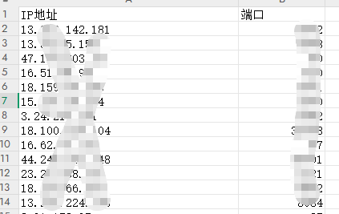

json则会自动析出results里面的内容：

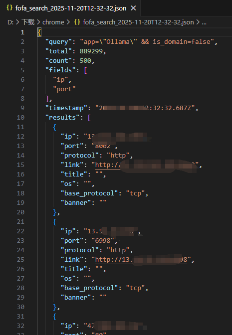


界面如下：

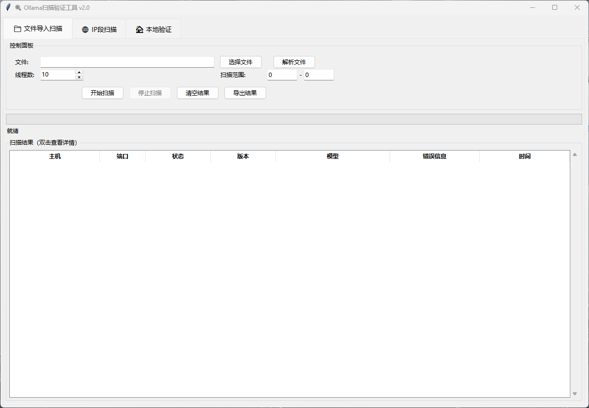

点击选择文件，然后点击你的csv或者json，再点击解析，就能看到预览解析效果：

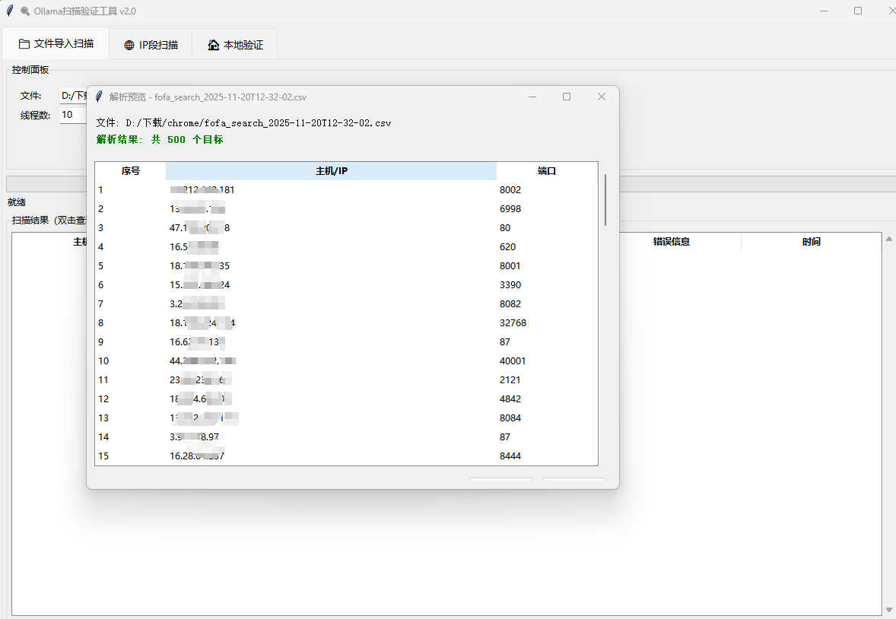


点击开始扫描，当然中途是可以停止扫描的！可以选择你需要扫描的范围，毕竟你不可能扫个几千几万个吧，搞几个意思意思就行了。

这边拿30个做一下测试：

可以看到一些基本信息：

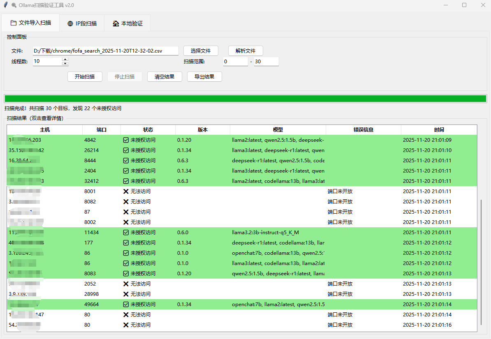

未授权就是绿色的，双击可以进入到实际验证地方，这个可以拖到最下面的本地验证看看最终效果。

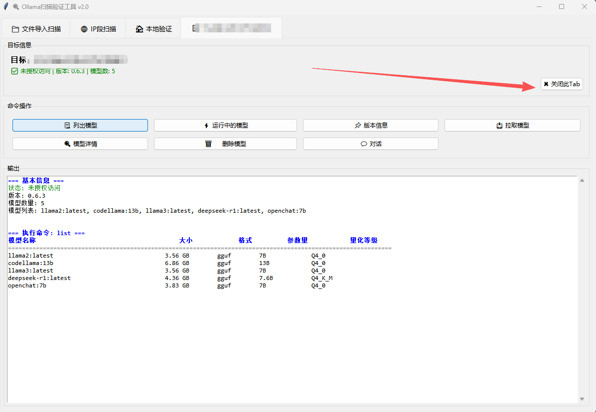

可以看到基本的信息啥的，还有一些功能如对话、删除模型、拉取模型啥的。

点击关闭此Tab就可以关掉这个临时页面了


怎么导出结果呢？直接点击就行了：

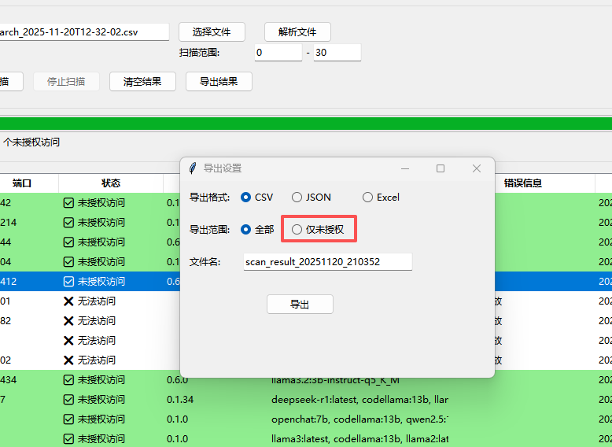

可以选择仅未授权和相应的格式，这边就不介绍了。


### IP段扫描

吃运气，最好就是内网授权的情况下，高校是重灾区哈。但也是碰运气，似乎现在机灵一点的都不会把端口放在11434了，我不太敢设置为扫服务哈，毕竟自用，你们可以加，暴力扫！

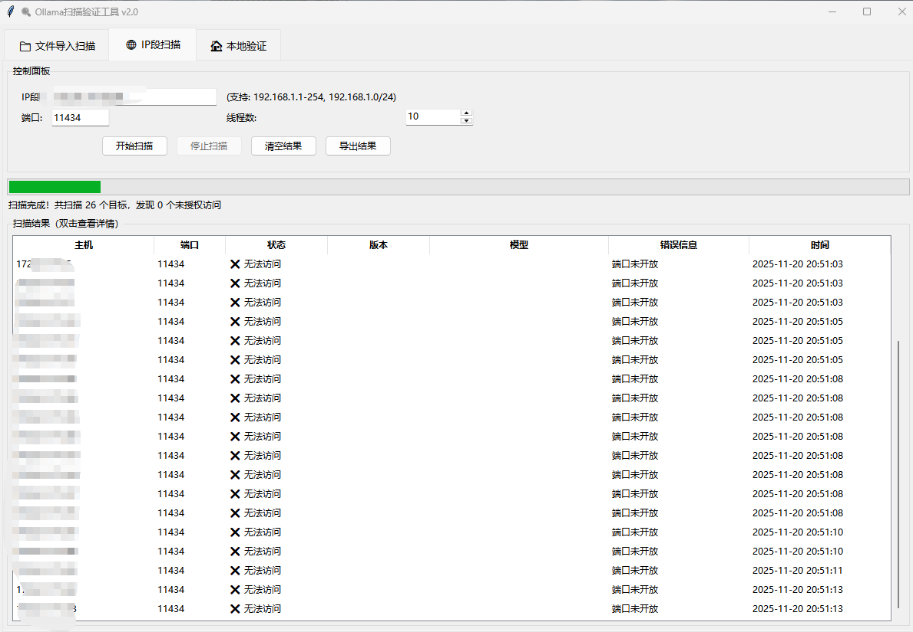

其他效果都是一样的。


### 本地验证

这个就来看一下模型操作的各个功能展示啦

#### 列出模型

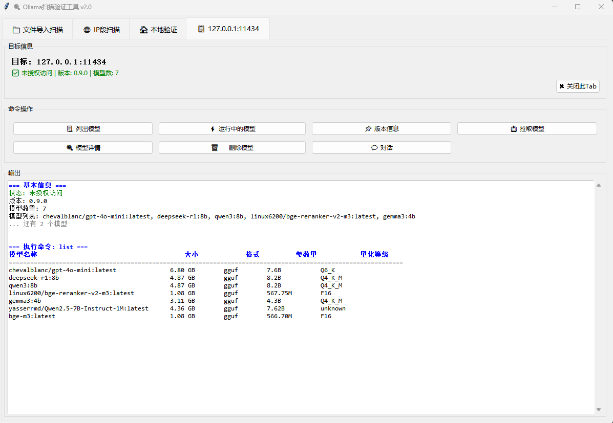


#### 运行中的模型

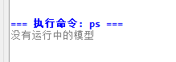

#### 版本信息

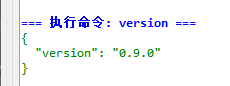

#### 拉取模型

搞个小的测试一下

好就这个`all-minilm:22m`了，就你了宝可梦

也是成功加上了

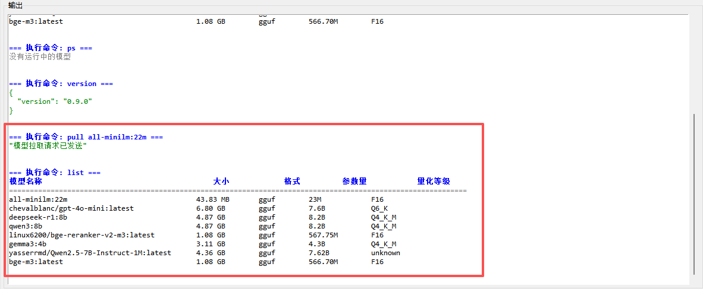


#### 模型详情

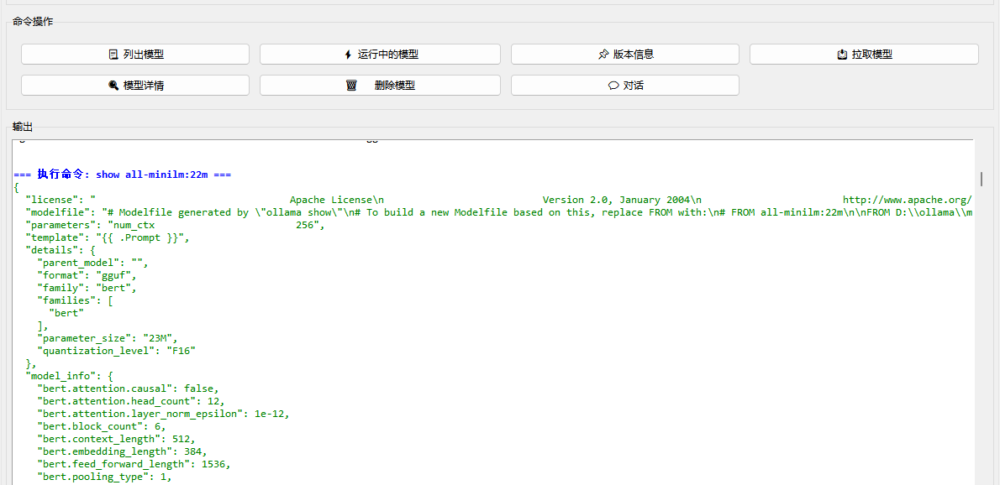


#### 删除模型

又是这个，记得复制全程。感觉可以加一个选取列表的。

`all-minilm:22m`


直接显示删除了


#### 对话

对话也是OK的，不过没啥用

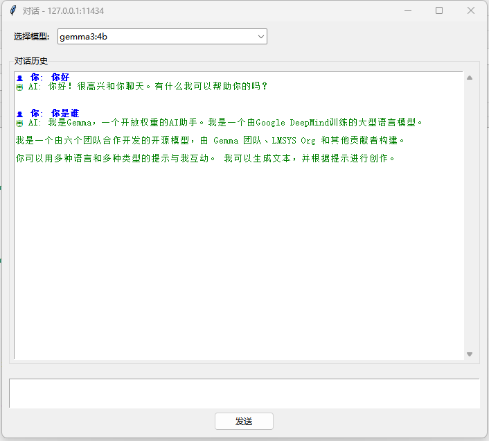


